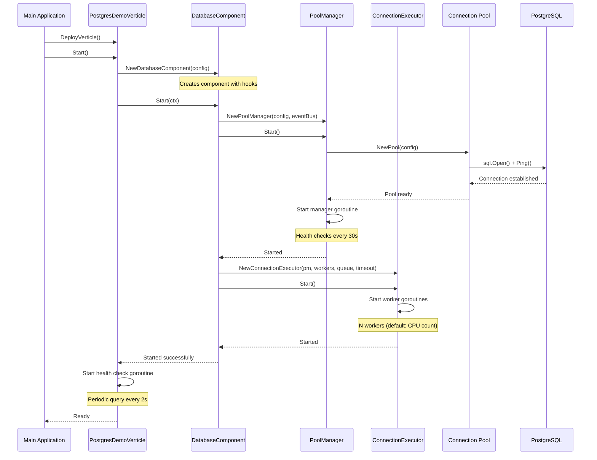
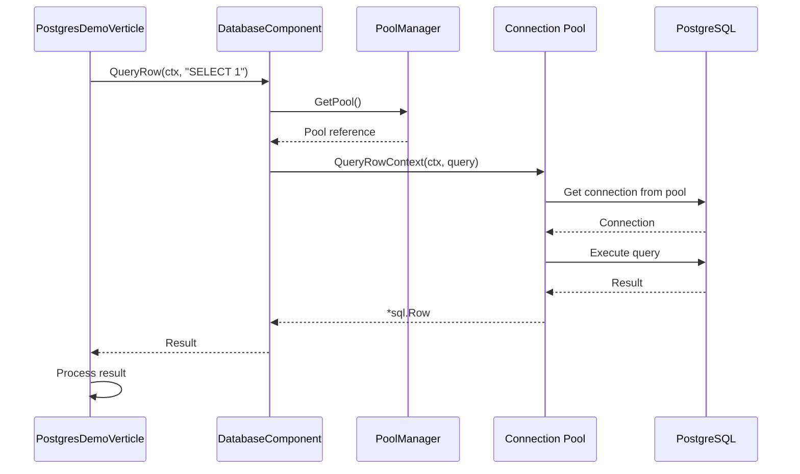
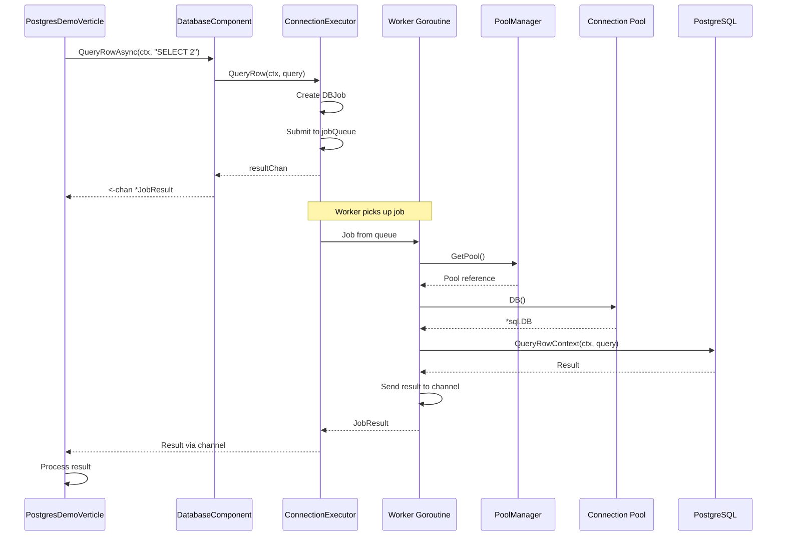
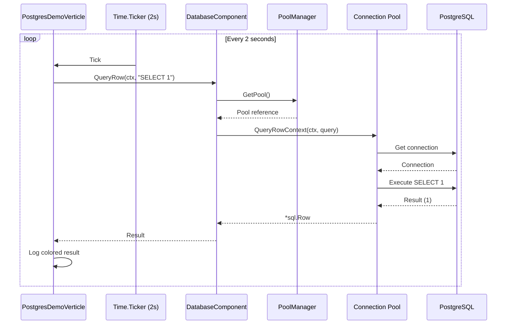
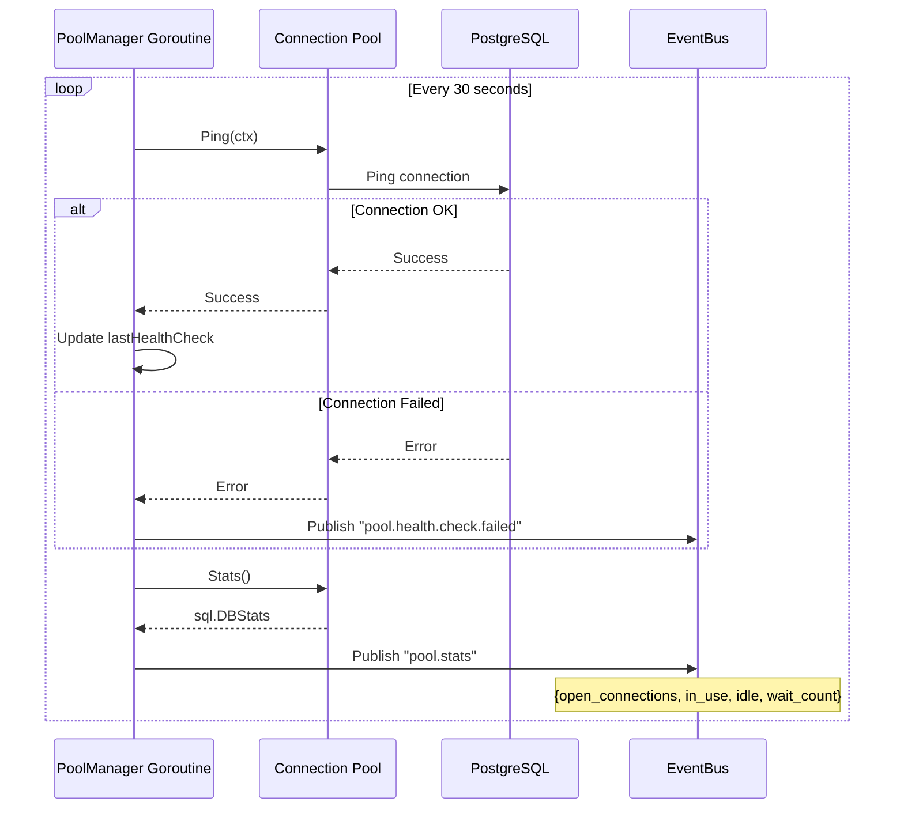
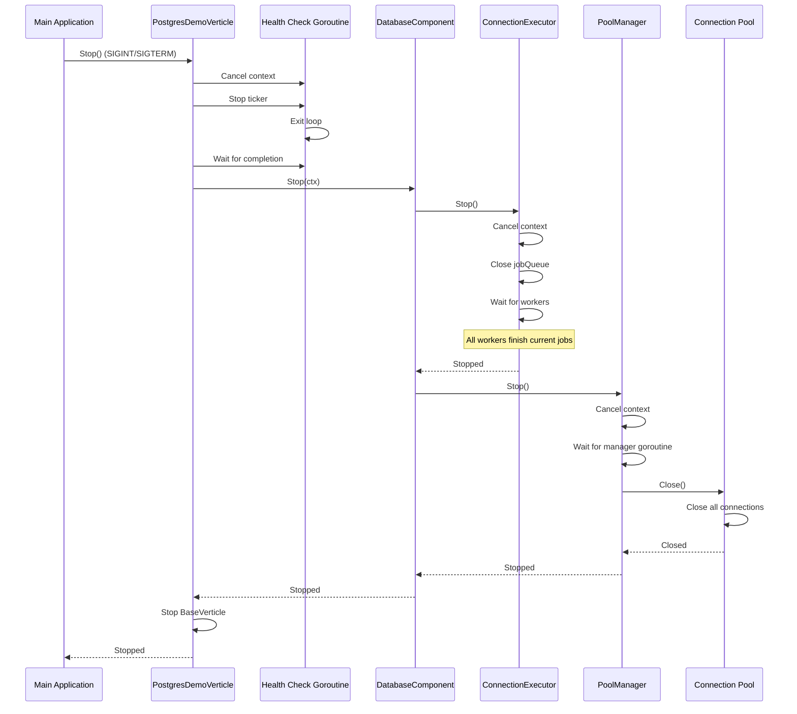
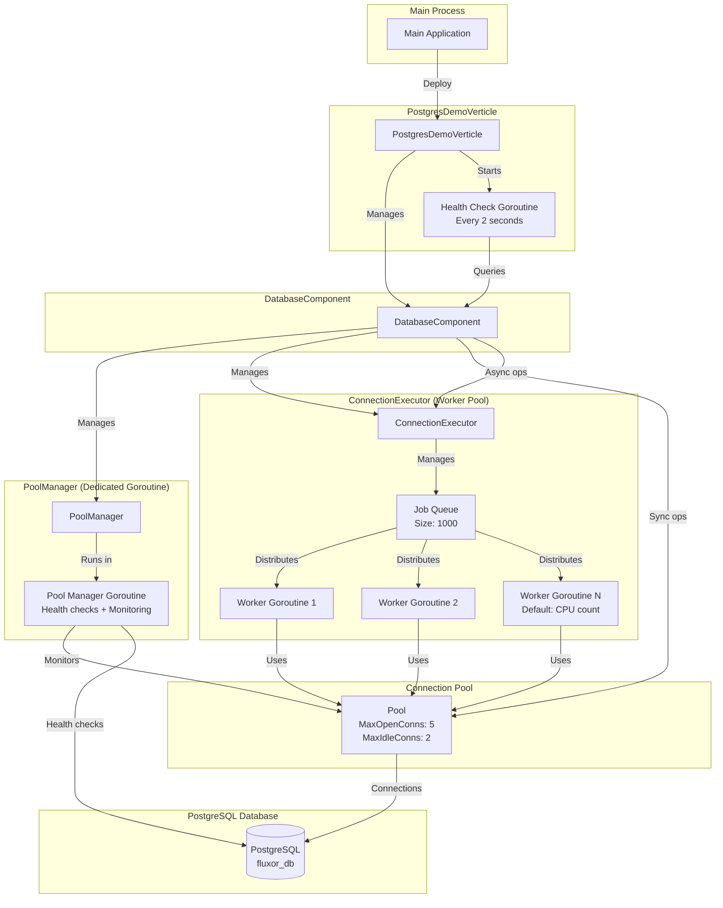

# Database Runtime Architecture Flow

## Overview
This document describes the flow of database operations in the separated architecture using PoolManager (dedicated goroutine) and ConnectionExecutor (worker goroutines).

## Architecture Components

### 1. PostgresDemoVerticle (Main Service)
- Main application verticle
- Manages database component lifecycle
- Executes business logic with database operations

### 2. DatabaseComponent
- Wraps PoolManager and ConnectionExecutor
- Provides synchronous and asynchronous database APIs
- Manages component lifecycle

### 3. PoolManager
- Runs in dedicated goroutine
- Manages connection pool lifecycle
- Performs health checks and monitoring
- Publishes pool statistics via EventBus

### 4. ConnectionExecutor
- Runs in worker goroutine pool
- Executes database operations asynchronously
- Handles job queue and worker distribution

## Flow Diagrams

### Component Initialization Flow

### Database Operation Flow (Synchronous)

### Database Operation Flow (Asynchronous)

### Health Check Flow

### Pool Manager Monitoring Flow

### Shutdown Flow

## Goroutine Architecture

## Key Points

1. **Separation of Concerns**:
   - PoolManager: Lifecycle and monitoring (dedicated goroutine)
   - ConnectionExecutor: Operation execution (worker pool)
   - DatabaseComponent: Unified API

2. **Concurrency**:
   - Each component runs in separate goroutines
   - No blocking between pool management and operations
   - Worker pool handles concurrent operations

3. **Thread Safety**:
   - All shared state protected by mutexes
   - Pool access is thread-safe
   - Job queue is channel-based (thread-safe)

4. **Scalability**:
   - Configurable worker count
   - Configurable queue size
   - Pool size limits prevent connection exhaustion

5. **Monitoring**:
   - Health checks every 30s (PoolManager)
   - Periodic queries every 2s (Verticle)
   - Statistics published via EventBus
