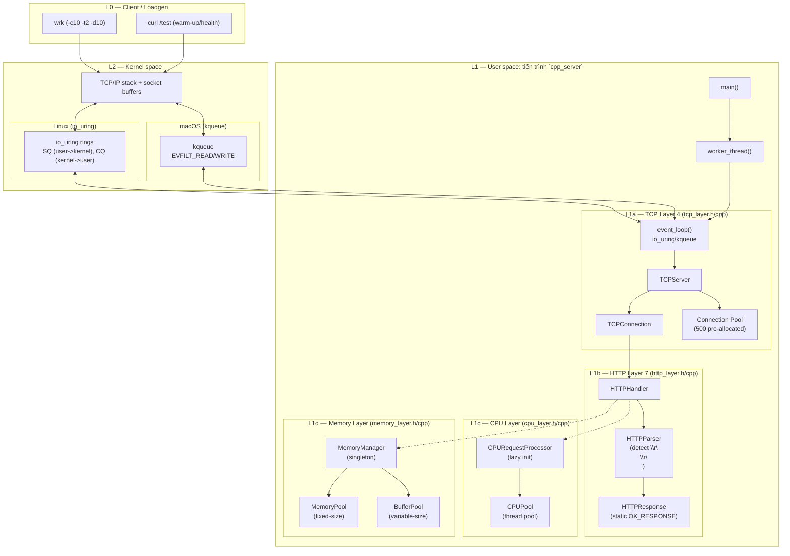
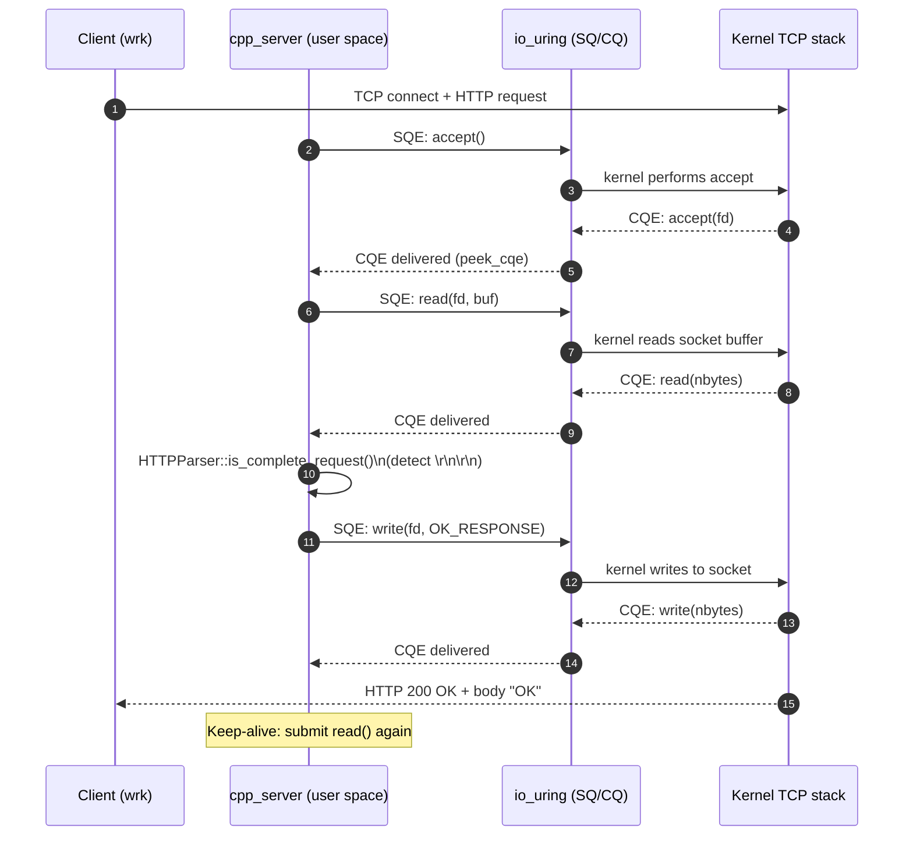
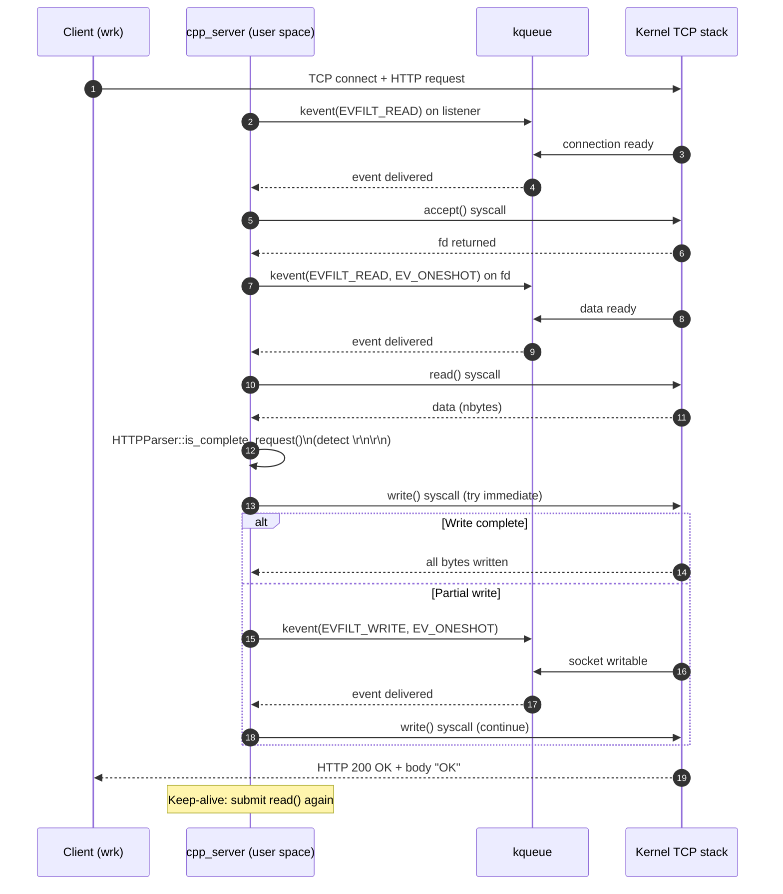

# Kiến trúc (Layered Architecture) — C++ High-Performance HTTP Server

## Tổng quan

Server được thiết kế theo kiến trúc phân lớp (layered architecture) với các tầng độc lập:
- **Layer 4 (TCP)**: Quản lý kết nối, event loop, I/O operations
- **Layer 7 (HTTP)**: HTTP parsing, request/response handling
- **CPU Layer**: Xử lý CPU-bound tasks, thread pool
- **Memory Layer**: Memory pools, buffer management

## Safe-first principles

Ưu tiên **đúng và an toàn runtime** trước, rồi mới tối ưu hiệu năng (tối ưu phải giữ invariants và có đo đạc).

- **Không UB (Undefined Behavior)**: không type-punning bằng cast, không strict-aliasing hacks không được document.
- **RAII cho tài nguyên OS**: socket/fd/eventfd/ring/pipe… destructor idempotent, không throw.
- **Bounds rõ ràng**: mọi buffer/slice phải đi kèm length; không advance `read_pos/write_pos` nếu chưa chứng minh capacity.
- **I/O state machine không kẹt**: `reading_/writing_` không bao giờ được “stuck true” trên nhánh lỗi/thiếu tài nguyên.
- **Concurrency có kỷ luật**: giảm shared mutable state; nếu lock/atomics thì phải document invariant + ordering.

Chi tiết + checklist: xem [`SAFE_FIRST.md`](SAFE_FIRST.md).

## Layer Map (Tổng quan)



## Layer Responsibilities (Tách rõ từng tầng)

### L0 — Client/Loadgen
- **`wrk`**: Tạo tải (connections/threads/duration) để đo RPS/latency
- **`curl`**: Warm-up/health check

### L1 — User Space (`cpp_server`)

#### L1a — TCP Layer 4 (`tcp_layer.h/cpp`)
- **TCPServer**: Quản lý listener socket, event loop, connection lifecycle
- **TCPConnection**: Đại diện cho một kết nối TCP, quản lý read/write buffers
- **Event Loop**:
  - **Linux**: `io_uring` - peek CQE, submit SQE, batch operations
  - **macOS**: `kqueue` - EVFILT_READ/WRITE với EV_ONESHOT, adaptive timeout
- **Connection Pooling**: 500 connections pre-allocated để tránh allocation trong hot path
- **Optimizations**:
  - Adaptive timeout (10ms → 100ms khi idle, reset về 10ms khi có events)
  - Batch `kevent()` operations (threshold 8) để giảm syscall overhead
  - Aggressive accept loop (50 accepts per event)
  - Listen backlog: 4096

#### L1b — HTTP Layer 7 (`http_layer.h/cpp`)
- **HTTPParser**: 
  - Detect end-of-headers (`\r\n\r\n`) theo RFC 7230
  - Parse request line (method, path, version)
  - Find header values
- **HTTPResponse**: Pre-built static responses (zero-allocation)
- **HTTPHandler**: Xử lý request, generate response, bridge với CPU layer

#### L1c — CPU Layer (`cpu_layer.h/cpp`)
- **CPUPool**: Thread pool với `std::thread::hardware_concurrency()` threads
- **CPURequestProcessor**: 
  - Detect CPU-bound requests (specific paths)
  - Submit tasks to thread pool
  - Lazy initialization (chỉ tạo khi cần)
- **Optimizations**:
  - Timeout trong `condition_.wait_for()` (100ms) để tránh spinning khi idle

#### L1d — Memory Layer (`memory_layer.h/cpp`)
- **MemoryPool**: Fixed-size allocations (aligned, thread-safe)
- **BufferPool**: Variable-size buffers (pre-allocated, reusable)
- **MemoryManager**: Singleton quản lý tất cả pools
- **ScopedBuffer**: RAII wrapper cho automatic cleanup

### L2 — Kernel Space

#### Linux (io_uring)
- **io_uring rings**: 
  - SQ (Submission Queue): user → kernel (submit ops)
  - CQ (Completion Queue): kernel → user (completions)
- **Shared memory**: Zero-copy communication
- **Kernel polling**: IORING_SETUP_SQPOLL (nếu kernel 5.11+)

#### macOS (kqueue)
- **kqueue**: Event notification mechanism
- **EVFILT_READ/WRITE**: Socket I/O events
- **EV_ONESHOT**: Auto-disable filter sau khi trigger (giảm syscalls)
- **Adaptive timeout**: Tăng khi idle, giảm khi active

#### TCP/IP Stack
- Nhận request từ loopback/NIC
- Đẩy data vào socket buffers
- Phục vụ read/write operations

## Luồng Request/Response (Sequence)

### Linux (io_uring)



### macOS (kqueue)



## Performance Metrics

### Current Performance (macOS)

| Concurrency | RPS | Avg Latency | Errors | Notes |
|-------------|-----|-------------|--------|-------|
| Low (`-c10 -t2`) | **239,754** | **37.37μs** | **0** | **Optimal for low load** ✅ |
| Medium (`-c100 -t12`) | **192,162** | **753μs** | **0** | **Sweet spot!** ✅ |
| High (`-c256 -t16`) | 189,379 | 1.23ms | 21 | Good, but higher latency |

### Comparison

- **Nginx**: ~87k RPS (macOS) - **Our server: 2.8x faster**
- **Go Server**: ~137k RPS - **Our server: 1.8x faster**

## Điểm "Nóng" (Hot Path) Optimizations

### Zero-Allocation Hot Path
- **Pre-allocated connections**: 500 connections trong pool
- **Static HTTP responses**: `OK_RESPONSE` là `constexpr`, zero-copy
- **Per-connection buffers**: allocated once at connection creation (pool prealloc) and reused,
  sized by `--buffer-size` (default 8192)

### Minimal HTTP Parsing
- **Fast path**: Chỉ detect `\r\n\r\n` (end-of-headers) để trả `OK` nhanh
- **No full parsing**: Không parse headers/values trừ khi cần
- **String view**: Dùng `std::string_view` để tránh allocations

### I/O State Machine
- **Clear state transitions**: `accept → read → write → read` (keep-alive)
- **Non-blocking I/O**: Tất cả sockets đều non-blocking
- **Batch operations**: 
  - Linux: Batch SQE submissions
  - macOS: Batch `kevent()` registrations (threshold 8)

### Event Loop Optimizations
- **Adaptive timeout**: 
  - 10ms khi có events (responsive)
  - Tăng lên 100ms khi idle (giảm CPU)
- **Immediate flush for reads**: Đảm bảo read events được register ngay
- **Batch flush for writes**: Flush khi có 8+ pending events

### CPU Affinity
- **Thread pinning**: Mỗi worker thread pin vào một CPU core
- **Linux**: `pthread_setaffinity_np()`
- **macOS**: `thread_policy_set(THREAD_AFFINITY_POLICY)`

## Platform-Specific Details

### Linux (io_uring)
- **Kernel requirement**: 5.1+ (5.11+ for SQPOLL)
- **Ring size**: 4096 entries
- **Flags**: `IORING_SETUP_SQPOLL` (nếu supported)
- **Advantages**: 
  - Zero-copy shared memory
  - Batch operations
  - Kernel polling (giảm syscalls)

### macOS (kqueue)
- **Event filters**: `EVFILT_READ`, `EVFILT_WRITE`
- **Flags**: `EV_ONESHOT` (auto-disable sau trigger)
- **Timeout**: Adaptive (10ms → 100ms)
- **Batch size**: 256 events per `kevent()` call
- **Advantages**:
  - Native macOS API
  - Efficient event notification
  - Low overhead

## Code Organization

```
cpp-server/
├── main.cpp              # Entry point, worker threads, signal handling
├── tcp_layer.h/cpp       # Layer 4: TCP connection management, event loop
├── http_layer.h/cpp     # Layer 7: HTTP parsing, request/response
├── cpu_layer.h/cpp      # CPU-bound processing, thread pool
├── memory_layer.h/cpp    # Memory pools, buffer management
├── Makefile              # Build system (platform detection)
└── ARCHITECTURE.md       # This file
```

## Future Enhancements

- [ ] HTTP/1.1 pipelining support
- [ ] Zero-copy `sendfile()` for static files
- [ ] Lock-free connection pool
- [ ] Per-thread connection pools (reduce contention)
- [ ] HTTP/2 support
- [ ] TLS/HTTPS support
- [ ] Metrics/monitoring integration